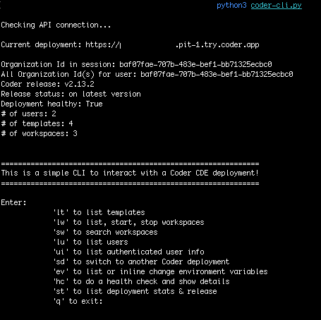

# Learning Coder's API

Coder is an OSS Cloud Development Environment platform

## Programming language

This example uses Python and is a command line application

## API

Coder has a REST API where a user's session token is provided in a header to authenticate the app to the Coder deployment 



## The app 

The app runs as a while loop prompting the user for actions like:
1. list templates
1. list workspaces
1. search workspaces with a filter e.g., `owner:me` or `flask`
1. list all users
1. show authenticated user information
1. list or override environment variable values
1. Switch Coder deployments
1. list deployment build information
1. list health details of the Coder deployment
1. start or stop a workspace from a list
1. present clickable URLs for workspaces and templates to open Coder in a browser
1. quit the app

When the app starts, it checks that environment variables have been entered and does test API calls to retrieve Coder release, # of users, templates and workspaces.

## Authentication

Credential is a session token. It is read as environment variable along with the Coder Access URL, API Route and Organization Id which you place in `.zshrc` or `.bashrc` of the host computer running the Docker daemon.

```sh
# set environment variables
export CODER_URL_1=""
export CODER_SESSION_TOKEN_1=""
```

Create a Coder Session Token either:

1. `http://your-access-url/cli-auth` from a browser
1. In the Coder UI or with Coder CLI, create a token `coder token create`

> If using the dev container, you cannot use localhost but instead the tunnel proxy URL or our host machine URL
> where Coder is deployed e.g., `https://*************.pit-1.try.coder.app`

At startup, the app gets Coder deployment's Organization Id with `http://your-access-url/api/v2/users/me` which you can also see from a browser.  `CODER_ORG_ID` is no longer required as an environment variable since the app retrieves it with an initial API call.

## Multiple Coder deployment support

The app allows up to 3 Coder deployments. When the app starts, the first one entered is loaded. There is an action in the CLI to switch to another deployment if environment variables have been entered.

```sh
# set environment variables
export CODER_URL_1=""
export CODER_SESSION_TOKEN_1=""
export CODER_URL_2=""
export CODER_SESSION_TOKEN_2=""
export CODER_URL_3=""
export CODER_SESSION_TOKEN_3=""
```

## Run the app

### as a binary

> Below are build instructions instead of including a large binary and build artifacts in this repo

1. Use a build tool like 'pip3 install pystaller'
1. 'pyinstaller --onefile --workpath /path/to/build/directory coder-cli.py'
1. Run `./coder-cli` from the `./dist` directory or add the directory to your path and run `coder-cli`

### from source
`cd` into the repo directory and run the app

```sh
python3 coder-cli.py
```

### from dev container

The dev container automatically starts the app with `"postCreateCommand": "python3 coder-cli.py"`

## Dev Container

Notice the `Dockerfile` and `devcontainer.json` which uses a slim Python container image in the Dockerfile, and passes the Coder authentication environment variables into the dev container.

This approach frees you up from having a specific Python version and module on your local machine e.g., Mac and let the dev container set all of this up. You do still need to set the environment variables locally which is more secure and better than putting into the repo with .gitignore. ☠️


## Packages

If not using a dev container, you will to 'pip install' the following packages:

```sh
requests
python-dateutil
pytz
```

## Resources

[Python Mac versions](https://www.python.org/downloads/macos/)

[Coder API docs](https://coder.com/docs/api)

[sharkymark Coder API call examples](https://github.com/sharkymark/v2-templates/blob/main/api.md)

[dev container spec](https://containers.dev/implementors/json_reference/)


## License

This project is licensed under the [MIT License](LICENSE)

## Contributing

### Disclaimer: Unmaintained and Untested Code

Please note that this program is not actively maintained or tested. While it may work as intended, it's possible that it will break or behave unexpectedly due to changes in dependencies, environments, or other factors.

Use this program at your own risk, and be aware that:
1. Bugs may not be fixed
1. Compatibility issues may arise
1. Security vulnerabilities may exist

If you encounter any issues or have concerns, feel free to open an issue or submit a pull request.